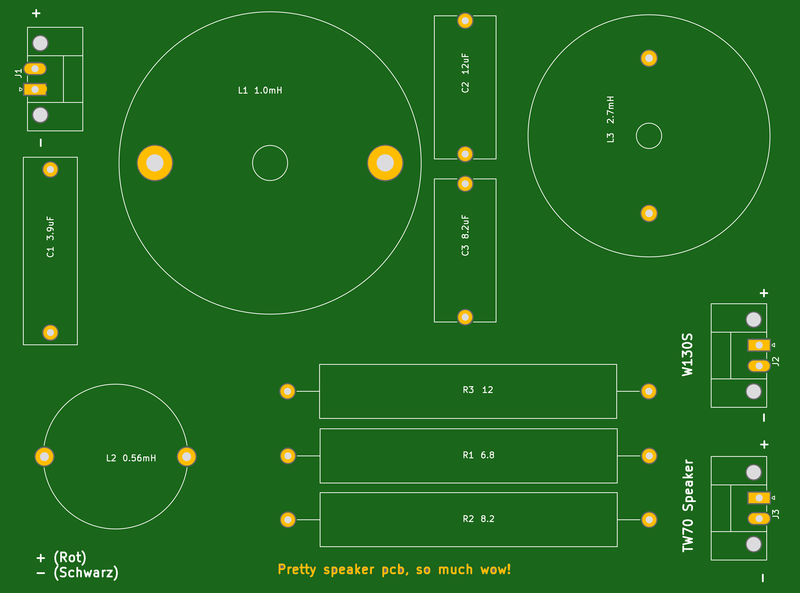
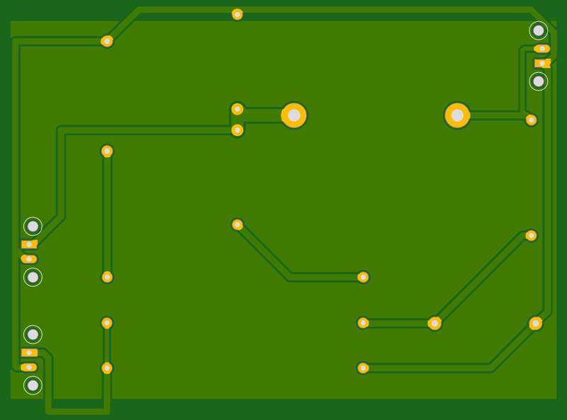

# Speaker Pcb

## About This Project

This PCB is a work-in-progress and has not yet been tested.

The speaker PCB is based on the schematic used in the Speaker Builder Workshop by Freie Maker e.V.

Additional documentation can be found [here](https://docs.google.com/document/d/1xRjg8uscsd9Le15cIWoDVk5CKfX-zGayms6dGGZDSWU/edit).

## Renderings

### Top

### Bottom

## BOM

|Count|Component|Details|Datasheet|
|-|-|-|-|
|3x|J1 / J2 / J3|CONN TERM BLOCK 45DEG 2POS 3.5MM|[Link](https://media.digikey.com/pdf/Data%20Sheets/Phoenix%20Contact%20PDFs/Combicon%20Compact%20Series.pdf)|

---

This project is managed and available on

You can view it [here](https://aisler.net/p/XABQRYWK). Start your own Powerful Prototype on [here](https://aisler.net).
